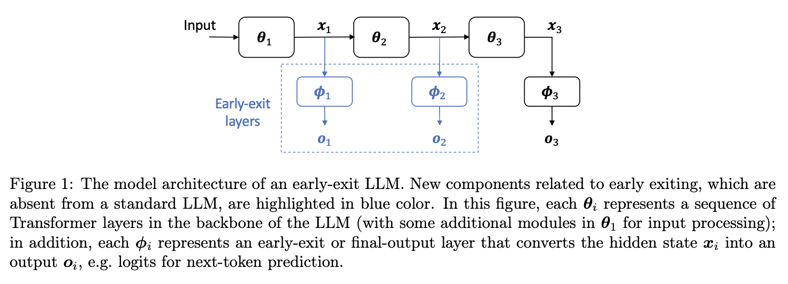

# EE-LLM: Early-Exit Large Language Models


[EE-LLM](https://arxiv.org/abs/2312.04916) is a framework for large-scale training and inference of early-exit (EE) large language models (LLMs), which is built upon [Megatron-LM](https://github.com/NVIDIA/Megatron-LM) and compatible with 3D parallelism (namely data, tensor, sequence and pipeline parallelism).




As shown in the above figure, an early-exit LLM can convert intermediate hidden states into outputs.
During inference, the model can select adaptively one early/final exit to generate the output for each input, without running the full-model forward pass.

Our system supports two methods of training early-exit LLMs:

- Full-parameter training, which updates model parameters by optimizing a weighted sum of losses from multiple exits;
- EE-Tuning, a parameter-efficient approach that augments an existing pre-trained LLM with early-exit layers and tunes them while modules of the original LLM are frozen.

Further details about the usage and functionalities of EE-LLM are introduced in the following.


## Installation

The installation of EE-LLM is the same as Megatron-LM.
We recommand using the 22.12 version of [NGC's PyTorch container](https://catalog.ngc.nvidia.com/orgs/nvidia/containers/pytorch) (nvcr.io/nvidia/pytorch:22.12-py3), which is also the development environment of EE-LLM.

For more details about the installation of Megatron-LM, please refer to Megatron-LM's [README](README_Megatron_LM.md).


## Full-parameter training

Below are several example training scripts used in our paper.


```shell
# train 1.3B model
./examples/ee_training/1-3B.sh

# train 7B model
./examples/ee_training/7B.sh

# train 13B model 
./example/ee_training/13B.sh

# train 30B model
./example/ee_training/30B.sh
```


The training data used in these scripts can be found in [Data-Juicer](https://github.com/alibaba/data-juicer/blob/main/configs/data_juicer_recipes/README.md). 
You can modify the `DATA_PATH` environment variable in the scripts to use your own dataset.
Note that Megatron-LM can only recognize preprocessed binary data; 
for more details about Megatron-LM's data preprocessing, please refer to [Data Preprocessing](README_Megatron_LM.md)

> Running the training scripts requires 16 Nvidia A100-80G GPUs or higher hardware specifications. To run them with fewer GPUs, please set the parallelism degrees therein to smaller values.


Below are some new configurations of EE-LLM compared to Megatron-LM. You can customize your own early-exit LLM by modifying these configurations.

### Configurations for model architectures

- `--exit-layer-nums`: indices of the Transformer layers converted to early-exit Transformer layers, starting from 1.
    > For example, `--exit-layer-nums 6 12` will add early exits to the 6th and 12th Transformer layers.

- `--pre-exit`: If set, the early-exit modules will be placed before the backbone of the Transformer layer, otherwise they will be placed after the backbone by default.
    > For example, the overall model architectures represented by `--exit-layer-nums 6 12` and `--exit-layer-nums 7 13 --pre-exit` are the same.

- `--untie-exit-output-weights`: If set, each early exit uses a different output word embedding, otherwise all early exits share the same output word embedding.

- `--use-exit-norm`: If set, add a Norm layer before the early-exit output word embedding.

- `--use-exit-mlp`: If set, add a MLP layer before the early-exit output word embedding.

- `--use-exit-block`: If set, add a complete Transformer layer before the early-exit output word embedding.

### Configurations for training

- `--exit-layer-weight`: The targeted loss weights of early exits. Must correspond to `--exit-layer-nums` one-to-one. Default to 1.0.

- `--exit-layer-weight-init`: The initial loss weights of early exits, which can be lower or higher than `--exit-layer-weight`.

- `--exit-layer-weight-warmup-iters`: The number of warm-up/cool-down iterations for early-exit loss weights (from `weight-init` to `weight`), default to 0.

- `--exit-layer-weight-warmup-style`: The increment function of early-exit loss weights, default to linear.

- `--fill-explicit-bubbles`: Enable filling explicit bubbles of the 1F1B pipeline schedule with additional microbatches. [Experimental]

- `--num-fill-warmup-microbatches`: The number of microbatches to be inserted during the warm-up phase of the 1F1B schedule. [Experimental]

- `--num-fill-cooldown-microbatches`: The number of microbatches to be inserted during the cool-down phase of the 1F1B schedule. [Experimental]

- `--backward-forward-ratio`: An estimate of the ratio of time consumption between backward and forward computation during training, used to automatically calculate the optimal number of inserted microbatches. Default to 2.0. [Experimental]


## EE-Tuning


> Before using EE-Tuning, please make sure that the existing LLM checkpoint is in Megatron-LM format.
> As an example, `examples/ee_tuning/convert/convert_llama_hf.sh` provides the functionality of converting the Llama 2 HuggingFace checkpoint into Megatron-LM format.


### Stage 1: initialize early-exit layers

The first step of EE-Tuning is to use `tools/checkpoint/checkpoint_converter.py` to add early-exit layers to the standard LLM checkpoint.
Example scripts can be found in the following file:

```shell
examples/ee_tuning/convert/add_exit_layers.sh
```

The relevant arguments are listed below:

- `--load-dir`: Path to the standard LLM checkpoint in Megatron-LM format.

- `--load-iteration`: The iteration number of the checkpoint to be loaded.

- `--save-dir`: Path to the output early-exit LLM checkpoint.

- `--add-exit-layer-nums`: Indices of the backbone Transformer layers that early exits are added to.

- `--use-exit-norm`: Add layer normalization (LayerNorm/RMSNorm) to the early-exit layer.

- `--use-exit-mlp`: Add a MLP to the early-exit layer.

- `--use-exit-block`: Add a Transformer layer to the early-exit layer.

- `--random-init`: Initialize model parameters of early-exit layers randomly. Otherwise, they are initialized as duplication of certain modules of the original LLM.

- `--megatron-path`: Path to EE-LLM root directory.


### Stage 2: tune early-exit layers

The second step of EE-Tuning is to tune the early-exit layers of the converted checkpoint, using scripts similar to those for [full-parameter training](#training). Below are some example scripts.

```shell
# tune Llama 2-Chat 13B with 8 exits
./examples/ee_tuning/tune/llama2_13B_8_exit_mlp_pt.sh

# tune Llama 2-Chat 13B with 1 exit (only load the first 1/4 of the model)
./examples/ee_tuning/tune/llama2_13B_1_exit_mlp_pt.sh
```

Below are the new parameters relevant to EE-Tuning. Other parameters are the same as those for full-parameter training.

- `--tune-exit`: Activate the functionality of EE-Tuning.

- `--tune-exit-pipeline-parallel-size`: Used to support partial checkpoint loading, only load pipeline stages whose stage numbers are not larger than this value.


## Inference

We provided a text generation server for inference of early-exit LLMs.
To start a server, you can use the following script.
Before running, please set `CHECKPOINT_PATH` to the root folder path of the checkpoint, and set `TP` and `PP` appropriately according to the parallelism degrees of the checkpoint.

```shell
./example/ee_inference/ee_inference_server.sh
```

After the server is started, you can use `tools/request_client.py` to send requests to the server.
Below are some parameters for early-exit LLM inference, which can be found in `tools/request_client.py`.

- `use_early_exit`: The early-exit feature is only enabled when this option is set, otherwise the model behaves exactly like a standard model without early exits.

- `early_exit_thres`: The confidence threshold used to determine whether to execute early exiting, ranging from 0.0 to 1.0.

- `print_max_prob`: If set, the inference server will print the token with the highest confidence and the confidence values at all exits.


## BibTeX

```
@misc{chen2023eellm,
    title={EE-LLM: Large-Scale Training and Inference of Early-Exit Large Language Models with 3D Parallelism}, 
    author={Yanxi Chen and Xuchen Pan and Yaliang Li and Bolin Ding and Jingren Zhou},
    year={2023},
    eprint={2312.04916},
    archivePrefix={arXiv},
    primaryClass={cs.LG}
}
```


